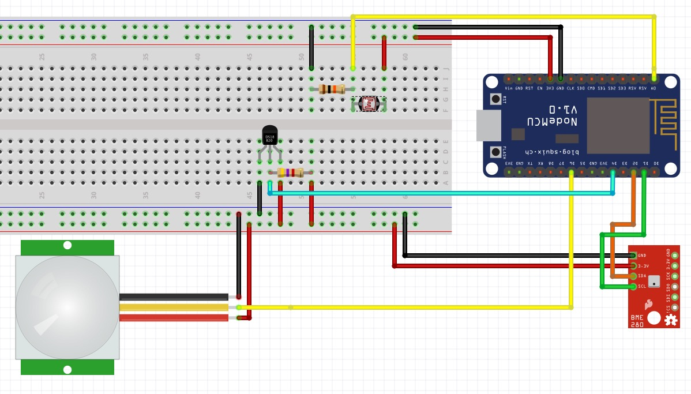

# NodeMCU home sensors integrated with MQTT

__This is work in progress. I've just uploaded my CRUD project files for now. Please be patient with me.__

### TL;DR



* Hook up your BME280 sensor: `SDA` = `D2` and `SCL` = `D1`.
* Hook up your light (or flame) sensor: `A0`.
* Hook up your PIR sensor: `D6`.
* Hook up your DS18b20 sensor: `D4`.
* Run a couple of commands:
```bash
$ cp ./platformio-dist.ini platformio.ini
$ pio lib install PubSubClient
$ pio lib install OneWire
$ pio lib install DallasTemperature
```

Edit `platformio.ini` with your credentials and other settings.

Upload and run your code:
```bash
$ pio run -e nodemcuv2 -t upload && pio serialports monitor -b 115200
```

Weee :-)

... more to come.

# Contribute
Please contribute with pull-requests.