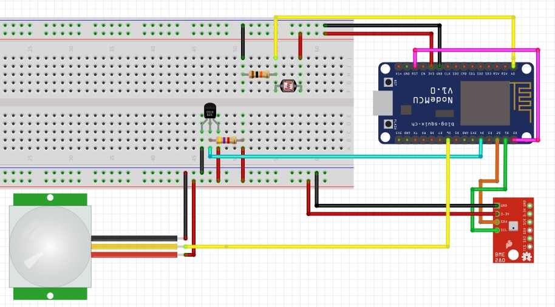

# NodeMCU home sensors integrated with MQTT

__This is work in progress. I've just uploaded my CRUD project files for now. Please be patient with me.__

## Data flow
```ascii
 --------     ---------     --------     -----     ----------     -------------
| sensor |-->| NodeMCU |   | MQTT   |   | AWS |   | AWS      |   | AWS         |
 --------   ^| ESP8266 |-->| Broker |-->| IoT |-->| IoT Rule |-->| Elasticache |
 --------  /  ---------     --------     -----     ----------     -------------
| sensor |/
 --------
```

### TL;DR



* Hook up your BME280 sensor: `SDA` = `D2` and `SCL` = `D1`.
* Hook up your light (or flame or gas MQ2) sensor: `A0`.
* Hook up your PIR sensor: `D6`.
* Hook up your DS18b20 sensor: `D4`.
* Hook up your MH-Z19 CO2 sensor: `RX` = `D7` and `TX` = `D8`
* Run a couple of commands:
```bash
$ cp ./platformio-dist.ini platformio.ini
# Install my  libraries from Platformio.org:
$ pio lib install Co2SensorMHZ19
$ pio lib install GenericAnalogSensor
$ pio lib install MqttUtil
$ pio lib install PirSensor
$ pio lib install SwitchSensor
```

All custom libraries can be found in this repo: https://github.com/5orenso/arduino-libs


Edit `platformio.ini` with your credentials and other settings.

Upload and run your code:
```bash
$ pio run -e nodemcuv2 -t upload && pio serialports monitor -b 115200
$ pio run -e d1_mini -t upload && pio serialports monitor -b 115200
```

Over The Air updates:
```bash
$ pio run -e nodemcuv2 -t upload --upload-port 192.168.1.6 && pio serialports monitor -b 115200
$ pio run -e d1_mini -t upload --upload-port 192.168.1.6 && pio serialports monitor -b 115200
```

Or just build the .bin and move it to your webserver updates:
```bash
$ pio run -e nodemcuv2
$ cp .pio/build/nodemcuv2/firmware.bin ./versions/4398831.bin

# Make version file for new device:
$ cp ./versions/4398831.version ./versions/4395765.version
$ cp ./versions/4398831.version ./versions/964698.version
$ cp ./versions/4398831.version ./versions/14754688.version

# Add firmware version:
# BME 280:
$ pio run -e nodemcuv2 \
    && cp .pio/build/nodemcuv2/firmware.bin ./versions/4398831.bin \
    && cp .pio/build/nodemcuv2/firmware.bin ./versions/4395765.bin \
    && cp .pio/build/nodemcuv2/firmware.bin ./versions/964698.bin \
    && aws s3 sync ./versions/ s3://litt.no-esp8266-fota/esp8266/fota/

# BME280, light:
$ pio run -e nodemcuv2 \
    && cp .pio/build/nodemcuv2/firmware.bin ./versions/14758780.bin \
    && aws s3 sync ./versions/ s3://litt.no-esp8266-fota/esp8266/fota/

# BME280, MQ3, DSM501A - PUBLISH_INTERVAL = 20 sec:
$ pio run -e nodemcuv2 \
    && cp .pio/build/nodemcuv2/firmware.bin ./versions/14754688.bin \
    && aws s3 sync ./versions/ s3://litt.no-esp8266-fota/esp8266/fota/


$ pio serialports monitor -b 115200
```

### Flashing the firmware:

Useful links:
* https://nodemcu.readthedocs.io/en/master/en/flash/

#### Install flasher tool
```bash
$ sudo easy_install pip
$ sudo pip install esptool
```

#### Building the firmware

https://nodemcu-build.com/


#### Checking device

```bash
$ esptool.py --port /dev/cu.SLAB_USBtoUART flash_id
esptool.py v2.7
Serial port /dev/cu.SLAB_USBtoUART
Connecting........_
Detecting chip type... ESP8266
Chip is ESP8266EX
Features: WiFi
Crystal is 26MHz
MAC: 2c:3a:e8:43:1e:ef
Uploading stub...
Running stub...
Stub running...
Manufacturer: 20
Device: 4016
Detected flash size: 4MB
Hard resetting via RTS pin...
```

#### Flashing the firmware

`flash-mode` is qio for most ESP8266 ESP-01/07 (512 kByte modules) and dio for most ESP32 and ESP8266 ESP-12 (>=4 MByte modules). ESP8285 requires dout.

```bash

$ esptool.py --port /dev/cu.SLAB_USBtoUART write_flash -fm dio 0x00000 nodemcu-master-8-modules-2017-07-18-07-22-28-float.bin


esptool.py --port <serial-port-of-ESP8266> write_flash -fm <flash-mode> 0x00000 <nodemcu-firmware>.bin

```

#### Gas Sensors

https://components101.com/sensors/mq-3-alcohol-gas-sensor

Sensor  |  Gas to measure
--------|-----------------------------------------------------------------------
MQ-2    |  Methane, Butane, LPG, Smoke
MQ-3    |  Alcohol, Ethanol, Smoke
MQ-4    |  Methane, CNG Gas
MQ-5    |  Natural gas, LPG
MQ-6    |  LPG, butane
MQ-7    |  Carbon Monoxide
MQ-8    |  Hydrogen Gas
MQ-9    |  Carbon Monoxide, flammable gasses
MQ131   |  Ozone
MQ135   |  Air Quality
MQ136   |  Hydrogen Sulphide gas
MQ137   |  Ammonia
MQ138   |  Benzene, Toluene, Alcohol, Propane, Formaldehyde gas, Hydrogen
MQ214   |  Methane, Natural Gas
MQ216   |  Natural gas, Coal Gas
MQ303A  |  Alcohol, Ethanol, smoke
MQ306A  |  LPG, butane
MQ307A  |  Carbon Monoxide
MQ309A  |  Carbon Monoxide, flammable gas


Weee :-)

... more to come.


## Other resources

* [Getting started with NodeMCU, Arduino or Wemos D1 mini](https://github.com/5orenso/arduino-getting-started)
* [NodeMCU code for the toilet sensors integrated with AWS IoT](https://github.com/5orenso/nodemcu-mqtt-toilet-project)
* [NodeMCU code for the toilet lights integrated with AWS IoT](https://github.com/5orenso/nodemcu-mqtt-toilet-project-display)
* [NodeMCU code for home sensors integrated with AWS IoT](https://github.com/5orenso/nodemcu-mqtt-home-sensors)
* [NodeMCU code for BME280 sensor integrated with AWS IoT](https://github.com/5orenso/nodemcu-mqtt-bme280)
* [NodeMCU code for DallasTemperature sensor integrated with AWS IoT](https://github.com/5orenso/nodemcu-mqtt-dallastemperature)
* [Arduino code for Neopixel animations](https://github.com/5orenso/nodemcu-neopixel-animations)
* [AMI for MQTT Broker](https://github.com/5orenso/aws-ami-creation)
* [All PlatforIO.org libs by Sorenso](http://platformio.org/lib/search?query=author%253A%2522Sorenso%2522)

## Contribute

Please contribute with pull-requests.
